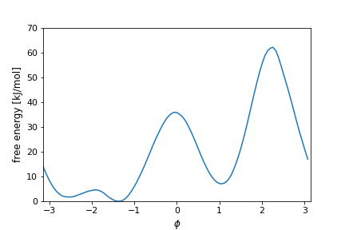

# PLUMED Masterclass 22.3: OPES method

## Origin

This masterclass was authored by Michele Invernizzi on February 28, 2022

## Aims

This Masterclass is an introduction to the [OPES](https://www.plumed.org/doc-master/user-doc/html/_o_p_e_s.html) method and its PLUMED implementation.

## Objectives

Once this Masterclass is completed, you will be able to:

- Perform OPES simulations and analyse the results.
- Use [OPES_EXPANDED](https://www.plumed.org/doc-master/user-doc/html/_o_p_e_s__e_x_p_a_n_d_e_d.html) to sample different generalized ensembles
- Test the effect of various [OPES_METAD](https://www.plumed.org/doc-master/user-doc/html/_o_p_e_s__m_e_t_a_d.html) input options
- Understand the typical use-case for [OPES_METAD_EXPLORE](https://www.plumed.org/doc-master/user-doc/html/_o_p_e_s__m_e_t_a_d__e_x_p_l_o_r_e.html)

## Prerequisites

We assume that you are familiar with PLUMED, metadynamics, umbrella sampling, and replica exchange.
If you are not, the 2021 PLUMED Masterclass from the graph is a good place to start.  We would also recommend reading
the papers that are linked in the graph.

## Overview of the theory

The OPES method is an evolution of Metadynamics that also incorporates some of the ideas of the [VES](https://www.plumed.org/doc-master/user-doc/html/_v_e_s.html) method.
OPES is designed to be simple to use and robust with respect to suboptimal collective variables.
Compared to metadynamics, it is faster in converging to a quasi-static bias and it handles multi-dimensional collective variables more efficiently.

The theory for the OPES method is presented in the papers that we give in the graph for this tutorial.
A short overview can also be found in the PLUMED documentation at [OPES](https://www.plumed.org/doc-master/user-doc/html/_o_p_e_s.html), [OPES_EXPANDED](https://www.plumed.org/doc-master/user-doc/html/_o_p_e_s__e_x_p_a_n_d_e_d.html), [OPES_METAD](https://www.plumed.org/doc-master/user-doc/html/_o_p_e_s__m_e_t_a_d.html), and [OPES_METAD_EXPLORE](https://www.plumed.org/doc-master/user-doc/html/_o_p_e_s__m_e_t_a_d__e_x_p_l_o_r_e.html).

## Setting up the software

For this Masterclass we will use GROMACS 2020.6 patched with PLUMED 2.8, with the OPES module and MPI enabled.
The easiest way to install all the software needed is to use the `plumed-masterclass-2022` conda environment, as described [here](https://github.com/plumed/masterclass-2022).

## Resources

The data needed to complete the exercises of this Masterclass can be found on [GitHub](https://github.com/invemichele/masterclass-22-03).
You can clone this repository locally on your machine with the usual command:

````
git clone https://github.com/invemichele/masterclass-22-03.git
````

The repository contains all the data to run the simulations, together with the scripts to analyse them.
It also contains some annotated [Jupyter notebooks](https://github.com/invemichele/masterclass-22-03/tree/master/notebooks), that will guide us through this tutorial.
Most of the information can be found there, and this page is mainly meant as an overview of the content of the notebooks.

As done in some previous masterclass, we will play with a toy system, the small alanine dipeptide molecule in vacuum (ala2).
It has the advantage of being a well-known system, cheap to simulate and with a higher level of complexity compared to a 2D model potential as the one used in this other [OPES_METAD](https://www.plumed.org/doc-master/user-doc/html/_o_p_e_s__m_e_t_a_d.html).
Ala2 has two main metastable basins which can be identified by a very efficient collective variable (CV), the $\phi$ torsional angle.
Here is its free energy surface (FES) as a function of the $\phi$ and $\psi$ angles:


_All the exercises have been tested with PLUMED version 2.8.0 and GROMACS 2020.6_

## Exercise 1: Sampling expanded ensembles with OPES

We start by using OPES to sample expanded ensembles.
This probably is not a familiar application of adaptive-bias enhanced sampling for most of PLUMED users, so we will first introduce some theory background.

### 1.1 Multithermal simulations

The first example we consider is a multithermal simulation of alanine dipeptide.
One can use replica exchange to perform a parallel tempering simulation and sample the two metastable states of alanine dipeptide.
Here instead, we want to sample the same multithermal distribution not by combining simulations at different temperatures, but by adding a bias potential to a single simulation.
You can find details on the relevant theory by searching through the graph for this tutorial.

<details>
    <summary><u>Click to expand</u></summary>

We choose 3 temperatures $T_0, T_1, T_2$, ranging from 300 K to 1000 K, and setup our GROMACS simulation to run at $T_0=300$ K.
Our target distribution is then:

$$p^{\text{tg}}(\mathbf{x})=\frac{1}{3}\left[\frac{e^{-\frac{1}{k_BT_0}U(\mathbf{x})}}{Z_0}+ \frac{e^{-\frac{1}{k_BT_1}U(\mathbf{x})}}{Z_1}+\frac{e^{-\frac{1}{k_BT_2}U(\mathbf{x})}}{Z_2}\right] .$$

This can be rewritten highlighting $P(\mathbf{x})$

$$p^{\text{tg}}(\mathbf{x})=P(\mathbf{x})\frac{1}{3}\left[1+ e^{-\left(\frac{1}{k_BT_1}-\frac{1}{k_BT_0}\right)U(\mathbf{x})}\frac{Z_0}{Z_1}+e^{-\left(\frac{1}{k_BT_2}-\frac{1}{k_BT_0}\right)U(\mathbf{x})}\frac{Z_0}{Z_2}\right] ,$$

and then using $\Delta F_i = -k_B T_0 \log \frac{Z_i}{Z_0}$:

$$p^{\text{tg}}(\mathbf{x})=P(\mathbf{x})\frac{1}{3}\left[1+ e^{-\frac{1-T_0/T_1}{k_BT_0}U(\mathbf{x})+\frac{1}{k_BT_0}\Delta F_1}+e^{-\frac{1-T_0/T_2}{k_BT_0}U(\mathbf{x})+\frac{1}{k_BT_0}\Delta F_2}\right] .$$

So we just need to know $\Delta F_1$ and $\Delta F_2$, and we can sample the target multithermal distribution by using the following bias:

$$V(U) = - k_B T_0 \log \frac{1}{3}\left[1+ e^{-\frac{1-T_0/T_1}{k_BT_0}U(\mathbf{x})+\frac{1}{k_BT_0}\Delta F_1}+e^{-\frac{1-T_0/T_2}{k_BT_0}U(\mathbf{x})+\frac{1}{k_BT_0}\Delta F_2}\right] ,$$

that is a function only of the potential energy $U=U(\mathbf{x})$.
In the OPES spirit, we estimate on-the-fly these free energy differences using a simple reweighting, and iteratively reach the target distribution.

The final bias expression is determined by these quantities $\frac{1-T_0/T_i}{k_BT_0}U(\mathbf{x})$, that we call [expansion_cv](https://www.plumed.org/doc-master/user-doc/html/expansion__c_v.html) (ECVs).
There are several types of expanded ensembles that might be of interest, and in order to sample them with OPES one simply needs to find the explicit form of the corresponding ECVs.
To sample the same expanded ensemble with replica exchange, one has to run a different replica of the system for each of the ECVs.
</details>

Enough equations, here is the plumed input file we need to run this multithermal simulation:

```plumed
ene: ENERGY
ecv: ECV_MULTITHERMAL ARG=ene TEMP_MIN=300 TEMP_MAX=1000 TEMP_STEPS=3
opes: OPES_EXPANDED ARG=ecv.ene PACE=500
```

We use the [OPES_EXPANDED](https://www.plumed.org/doc-master/user-doc/html/_o_p_e_s__e_x_p_a_n_d_e_d.html) bias action, with a multithermal expansion defined by the [ECV_MULTITHERMAL](https://www.plumed.org/doc-master/user-doc/html/_e_c_v__m_u_l_t_i_t_h_e_r_m_a_l.html) action.
The resulting bias is a function of the potential energy, and is updated every 500 MD steps.

In the notebook we show the shape of the resulting bias, how to check for convergence and how to reweight for estimating the free energy at different temperatures.
We also explain a simple procedure that is used to automatically set a reasonable number of temperature steps, if TEMP_STEPS is not provided.

### Multiumbrella simulations

Next, we present another expanded ensemble that can also be sampled by replica exchange.
We call it multiumbrella and it is composed by all the distributions sampled by a typical multiple windows umbrella sampling simulation.
In this kind of umbrella sampling, one chooses a CV and runs several simulations each one with a parabolic bias potential at a different CV location.
We can use OPES to sample an expanded target distribution that is composed of all of these combined.

In multiple windows umbrella sampling, the free energy difference between the windows is estimated during postprocessing (e.g. with WHAM), in OPES this is done on-the-fly at simulation time.
The main advantages are that choosing the number and location of the umbrellas becomes easier, and having a single longer simulation can also help with sampling orthogonal slow degrees of freedom.

We choose as CV the $\phi$ angle.
The ECVs we need for this type of expansion are the following:

$$\Delta u_i = \frac{(\phi-\phi_i)^2}{2\sigma^2} ,$$

where $\phi_i$ are the fixed centers of the umbrellas and $\sigma$ determines their width.
Usually in umbrella sampling another parameter is used, $k=1/\sqrt{\sigma}$, but we will see in the notebook why we made a different choice.

The plumed input we need might look like this:

```plumed
phi: TORSION ATOMS=5,7,9,15
ecv: ECV_UMBRELLAS_LINE ARG=phi CV_MIN=-pi CV_MAX=pi SIGMA=0.2
opes: OPES_EXPANDED ARG=ecv.phi PACE=500
```

This places umbrellas uniformly along $\phi$, each one separated by a distance of one $\sigma$.
We can make them less close to each with the keyword SPACING.
We can also provide a guess of the maximum free energy BARRIER we need to overcome, it can help speed up convergence.

In the notebook we show what kind of sampling this input provides, and invite you to play around with the parameters, to get a sense of what each option does.
We also perform reweighting to obtain a FES estimate.
This reweighting is done with kernel density estimation (similarly to plumed [HISTOGRAM](https://www.plumed.org/doc-master/user-doc/html/_h_i_s_t_o_g_r_a_m.html) function), and is interesting to see the effect of changing the bandwidth parameter.


### 1.3 Combined multithermal and multiumbrella simulations

Another advantage of using OPES to sample expanded ensembles is that it makes it very easy to combine them.
We show this by running a combined multithermal and multiumbrella simulation of alanine dipeptide.

Using the multithermal expansion, we were able to sample both metastable states, but not very efficiently.
With the multiumbrella target distribution we have many transitions, but we sample only at 300 K.
By combining these two expansions we obtain the best of both, with frequent transitions and an efficient reweighting over a whole range of temperatures.

The drawback? We might have to deal with a lot of ECVs!
However, while in a replica exchange scheme each ECV requires its own replica, with OPES we are free to use just one, or choose any number of parallel replica, in a multiple walkers scheme.

The way we combine expansions is to create a grid with all possible combinations of temperature ECVs and umbrella ECVs.
So, if we have 10 ECVs for the temperature expansion and 20 for the multiumbrella one, we end up with 200 combined ECVs.
This will become clearer once we look at the notebook and the simulation output.

From the point of view of the plumed input things are quite straightforward.
For a combined multithermal-multiumbrella simulation it should look similar to this one:

```plumed
# temperature expansion, based on energy
ene: ENERGY
ecv_mt: ECV_MULTITHERMAL ARG=ene TEMP_MIN=300 TEMP_MAX=1000
# multiumbrella expansion, based on phi
phi: TORSION ATOMS=5,7,9,15
ecv_mu: ECV_UMBRELLAS_LINE ARG=phi CV_MIN=-pi CV_MAX=pi SIGMA=0.2
# the OPES bias combines them
opes: OPES_EXPANDED ARG=ecv_mt.ene,ecv_mu.phi PACE=500
```

To fully appreciate the strength of combining these two different expansions, one can run the same simulations but using the $\psi$ angle instead of $\phi$, and see what happens.

## Exercise 2: OPES for metadynamics-like simulations

We now use OPES to perform biased simulations very similar to those of metadynamics.
We will sample a well-tempered distribution along a chosen set of collective variables.

### 2.1 Biasing a good CV

We start by biasing the $\phi$ angle, which is known to be a good CV for alanine dipeptide.
Here is how the FES along this CV looks like:



We use this simple example to get familiar with [OPES_METAD](https://www.plumed.org/doc-master/user-doc/html/_o_p_e_s__m_e_t_a_d.html), its input parameter and output quantities.
We also compare it with well-tempered metadynamics, and we start to see how this two methods differ.

This also gives us the opportunity of using some of the postprocessing scripts for OPES.
For OPES, there is not yet a tool similar to the [sum_hills](https://www.plumed.org/doc-master/user-doc/html/sum_hills.html), but we can obtain the same result with simple python scripts and by dumping the state of the simulation through the STATE_WFILE keyword.
This STATE file contains the compressed kernels used by OPES at a given time to represent the probability distribution, and thus the bias.

### Biasing two good CVs

Next, we move to biasing both the Ramachandran angles of ala2.
A minimal plumed input to do this is the following:

```plumed
phi: TORSION ATOMS=5,7,9,15
psi: TORSION ATOMS=7,9,15,17
opes: OPES_METAD ARG=phi,psi PACE=500 BARRIER=40
```

This example gives us a nice opportunity to visualize the kernel compression algorithm in action.
We can also get an idea of the differences between [OPES_METAD](https://www.plumed.org/doc-master/user-doc/html/_o_p_e_s__m_e_t_a_d.html) and [OPES_METAD_EXPLORE](https://www.plumed.org/doc-master/user-doc/html/_o_p_e_s__m_e_t_a_d__e_x_p_l_o_r_e.html) methods.
The plumed inputs are identical:

```plumed
phi: TORSION ATOMS=5,7,9,15
psi: TORSION ATOMS=7,9,15,17
opes: OPES_METAD_EXPLORE ARG=phi,psi PACE=500 BARRIER=40
```

From here it should be easy to compare both OPES variants to metadynamics, maybe by running some longer simulations.
We can also check the way the bias converges by focusing on the estimate of the free energy difference between the basins.

### Biasing more CVs: alanine tetrapeptide

In order to experiment with more than two CVs, we have to introduce a new system, alanine tetrapeptide in vacuum (ala4).
It is a bigger brother of ala2, with not one but three $\phi$ and $\psi$ torsional angles, that can be used to sample its 8 metastable basins.

We can try to sample ala4 with each of the tree methods, [METAD](https://www.plumed.org/doc-master/user-doc/html/_m_e_t_a_d.html), [OPES_METAD](https://www.plumed.org/doc-master/user-doc/html/_o_p_e_s__m_e_t_a_d.html), and [OPES_METAD_EXPLORE](https://www.plumed.org/doc-master/user-doc/html/_o_p_e_s__m_e_t_a_d__e_x_p_l_o_r_e.html).
How will the respective input files look like?

We run only short simulations to see how quickly the CV space is sampled by the various methods, and not for converging a FES.
This example can help to appreciate the effect of the $Z$ term in [OPES_METAD](https://www.plumed.org/doc-master/user-doc/html/_o_p_e_s__m_e_t_a_d.html).
In fact, the more CVs there are, the more it plays an important role in speeding up exploration.

We can also see the effect of changing the bias factor $\gamma$ on the sampling efficiency.


### 2.4 Biasing a suboptimal CV

Finally, what is probably the most interesting scenario.
We bias again ala2, but this time using a suboptimal collective variable.
We don't know much about this CV, it could be for instance the output of a machine learning procedure.
Will we be able to calculate the FES as a function of this CV? How should the plumed input files look like?
Here it would be nice to also have some error bars to our estimates.

We will discuss together the results of these simulations, and also reveal how this CV was constructed.

If you prefer a more straightforward example of suboptimal CV, you can check out this other [OPES_METAD tutorial](https://www.plumed.org/doc-master/user-doc/html/opes-metad.html).

## Conclusion

Hopefully this masterclass helped you to start playing around with the OPES method and get a sense of what it can be useful for.
If you are still interested in testing it out and understanding more about it, then you should check out the [PLUMED-NEST](https://www.plumed-nest.org/browse.html).
Just search for "opes" and you will find several papers that use the method, together with all the input files necessary to reproduce their simulations.
